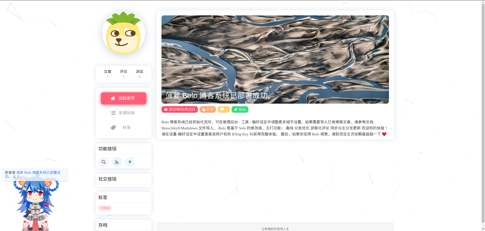

<p align = "center">

<br><br>
使用 docker-compose 一键启动 bolo 博客
<br>


<br>


<!--  -->
<!--  -->
<!--  -->
</p>

# 简介

本项目专注于使用 docker-compsoe 进行容器的编排，实现 bolo 博客的一键启动，以避免广大人民群众在进行 bolo 部署时走不必要的弯路；降低了使用门槛，同时也大大增加了维护与迁移的便利性，同时也增加了 `Let's Encrypt` SSL证书的自动配置与续签。

**注意：本项目使用 nginx 的反向代理作为 bolo 的 web 服务器、支持一键式的http & https 部署（默认占用了80、443 端口）。**

## 快速开始

### 安装 Dcoker 以及 docker-compose 运行环境

[1. 安装 Docker](https://docs.docker.com/engine/install/)

[2. 安装 docker-compose](https://docs.docker.com/compose/install/)

### 服务器部署

默认 bolo 的访问域名为 expoli.tech，请根据需要同步修改 `bolo-env.env` 与 `letsencrypt.env` 中的网址与邮件地址， **强烈建议将数据库密码修改为强密码！同时别忘对所有密码项进行同步更改！** 修改完成后根据 [本地快速部署测试](#本地快速部署测试)，进行后续步骤即可。

```
# mysql env
# 建议使用强密码
MYSQL_ROOT_PASSWORD=new_root_password
MYSQL_USER=bolo
MYSQL_DATABASE=bolo
MYSQL_PASSWORD=bolo123456

# bolo env
# 请同步更新为上方MYSQL密码
RUNTIME_DB=MYSQL
JDBC_USERNAME=bolo
JDBC_PASSWORD=bolo123456
JDBC_DRIVER=com.mysql.cj.jdbc.Driver
JDBC_URL=jdbc:mysql://db:3306/bolo?useUnicode=yes&characterEncoding=UTF-8&useSSL=false&allowPublicKeyRetrieval=true&serverTimezone=UTC


#
# 需要修改为你的博客域名
#
SERVER_HOST=expoli.tech

# 你一般不需要修改
SERVER_PORT=
SERVER_SCHEME=https
LISTEN_PORT=8080

```

**启动参数说明：**

- `--listen_port` ：进程监听端口
- `--server_scheme` ：最终访问协议，如果反代服务启用了 HTTPS 这里也需要改为 https
- `--server_host` ：最终访问域名或公网 IP，不要带端口
- `--server_port` ：最终访问端口，使用浏览器默认的 80 或者 443 的话值留空即可

详情请参考：[Solo 用户指南](https://hacpai.com/article/1492881378588)

### 启用HTTPS

**注意：启用HTTPS时需保证你的主机拥有公网IP且、80 443 端口可以被正常访问，否则有可能自动颁发证书失败**

修改相应的字段值为自己所需，各环境变量所代表含义请参阅 https://github.com/nginx-proxy/docker-letsencrypt-nginx-proxy-companion

```
VIRTUAL_HOST=expoli.tech
LETSENCRYPT_HOST=expoli.tech
LETSENCRYPT_EMAIL=me@expoli.tech

```

### 快速部署

- **克隆本项目**

```shell
git clone https://github.com/expoli/start-bolo-with-docker-compose.git
```

- **进入至项目根路径**

```shell
cd start-bolo-with-docker-compose
```

- **加载修改后的环境变量**

```shell
export $(cat ./bolo-env.env )
```

- **使用 docker-compose 启动 bolo**

```shell
# 后台启动
export $(cat ./bolo-env.env ) && docker-compose up -d

# 前台方式启动可以看到日志输出、方便进行排错
export $(cat ./bolo-env.env ) && docker-compose up
```

- **更新容器**

```shell
export $(cat ./bolo-env.env ) && docker-compose pull && docker-compose up -d
```

- **删除容器与 docker 网络（但保留关键数据）**

```shell
export $(cat ./bolo-env.env ) && docker-compose down
```

- **完全删除  危险！！！**

如果你想完全卸载 bolo 只需要删除本项目文件夹即可、**因为mysql数据库文件挂载至了本项目的mysql自文件夹**，这种方式也防止因不熟悉docker-compse导致了数据的丢失。

```shell
export $(cat ./bolo-env.env ) && docker-compose down --volume
```

### 迁移

可根据docker官方 volume 数据迁移指导进行数据迁移。也可直接 dump 出数据库表，在新机器上进行导入。

```shell
# Backup
docker exec CONTAINER /usr/bin/mysqldump -u root --password=root DATABASE > backup.sql

# Restore
cat backup.sql | docker exec -i CONTAINER /usr/bin/mysql -u root --password=root DATABASE
```

### 启用定时更新

<details>
<summary>定时更新</summary>

可使用 Linux 的定时任务实现定时更新。具体实现方式如下：

1. 手动运行定时命令进行测试

```bash
cd /path/to/your/docker-compose && export $(cat ./bolo-env.env ) && docker-compose pull && docker-compose down && docker-compose up -d
```

2. 确认运行无误之后将其添加至定时任务中

编辑 `/var/spool/cron/你的用户名` 文件，将下面这一行添加至文件中即可。（每周五的凌晨2点钟进行更新）时间间隔可随意设置、写法可参考 https://crontab.guru/

```shell
0  2  *  *  5  cd /path/to/your/docker-compose && export $(cat ./bolo-env.env ) && docker-compose pull && docker-compose down && docker-compose up -d
```
</details>

### 访问测试

<details>
<summary>点击查看访问测试</summary>

再确认已经启动完成之后、使用浏览器访问您设置的对应域名即可完成博客的初始化。

- bolo 初始化界面


- bolo 初始化完成界面

</details>

## 详细介绍

<details>
<summary>点击查看项目介绍</summary>

### docker-compose.yaml

```yaml
version: '3'

services:
  db:
    image: mariadb
    command: --max_allowed_packet=32505856 --character-set-server=utf8mb4 --collation-server=utf8mb4_general_ci --transaction-isolation=READ-COMMITTED --binlog-format=ROW
    restart: always
    volumes:
      - db:/var/lib/mysql
    # environment:
    #   - MYSQL_ROOT_PASSWORD=
    #   - MYSQL_PASSWORD=
    #   - MYSQL_DATABASE=
    #   - MYSQL_USER=
    env_file:
      - bolo-env.env

  web:
    build: ./web
    restart: always
    volumes:
      - bolo:/var/www/html:ro
    # environment:
    #   - VIRTUAL_HOST=
    #   - LETSENCRYPT_HOST=
    #   - LETSENCRYPT_EMAIL=
    depends_on:
      - bolo
    env_file:
      - letsencrypt.env
    networks:
      - proxy-tier
      - default

  proxy:
    build: ./proxy
    restart: always
    ports:
      - 80:80
      - 443:443
    labels:
      com.github.jrcs.letsencrypt_nginx_proxy_companion.nginx_proxy: "true"
    volumes:
      - certs:/etc/nginx/certs:ro
      - vhost.d:/etc/nginx/vhost.d
      - html:/usr/share/nginx/html
      - /var/run/docker.sock:/tmp/docker.sock:ro
    # environment:
    #   - ENABLE_IPV6=true
    networks:
      - proxy-tier

  letsencrypt-companion:
    image: jrcs/letsencrypt-nginx-proxy-companion
    restart: always
    volumes:
      - certs:/etc/nginx/certs
      - vhost.d:/etc/nginx/vhost.d
      - html:/usr/share/nginx/html
      - /var/run/docker.sock:/var/run/docker.sock:ro
    # environment:
    #   - DEFAULT_EMAIL=
    env_file:
      - letsencrypt.env
    networks:
      - proxy-tier
    depends_on:
      - proxy

  bolo:
    image: tangcuyu/bolo-solo:latest
    restart: always
    expose:
      - "8080"
    env_file:
      - bolo-env.env
    command: --listen_port=${LISTEN_PORT} --server_scheme=${SERVER_SCHEME} --server_host=${SERVER_HOST} --server_port=${SERVER_PORT} --lute_http=http://lute:8249
    depends_on:
      - db

  lute:
    image: b3log/lute-http
    restart: always 
    expose: 
      - "8249"

volumes:
  db:
  bolo:
  certs:
  vhost.d:
  html:

networks:
  proxy-tier:
```

</details>
