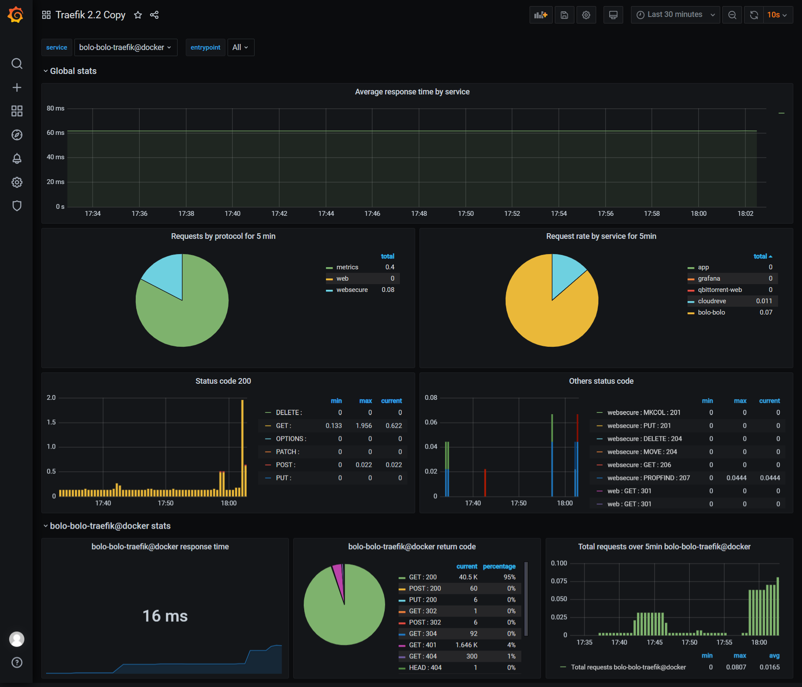

<p align = "center">

<br><br>
使用 docker-compose 一键启动 bolo 博客
<br>


<br>


<!--  -->
<!--  -->
<!--  -->
</p>

# 简介

本项目专注于使用 docker-compsoe 进行容器的编排，实现 bolo 博客的一键启动，以避免广大人民群众在进行 bolo 部署时走不必要的弯路；降低了使用门槛，同时也大大增加了维护与迁移的便利性，同时也增加了 `Let's Encrypt` SSL证书的自动配置与续签。

**注意：本项目使用 nginx 的反向代理作为 bolo 的 web 服务器、支持一键式的http & https 部署（默认占用了80、443 端口）。**

## 快速开始

### 安装 Dcoker 以及 docker-compose 运行环境

[1. 安装 Docker](https://docs.docker.com/engine/install/)

[2. 安装 docker-compose](https://docs.docker.com/compose/install/)

### 服务器部署

默认 bolo 的访问域名为 expoli.tech，请根据需要同步修改 `bolo-env.env` 中的各环境变量， **强烈建议将数据库密码修改为强密码！同时别忘对所有密码项进行同步更改！** 修改完成后根据 [本地快速部署测试](#本地快速部署测试)，进行后续步骤即可。

```
# mysql env
# 建议使用强密码
MYSQL_ROOT_PASSWORD=new_root_password
MYSQL_USER=bolo
MYSQL_DATABASE=bolo
MYSQL_PASSWORD=bolo123456

# bolo env
# 请同步更新为上方MYSQL密码
RUNTIME_DB=MYSQL
JDBC_USERNAME=bolo
JDBC_PASSWORD=bolo123456
JDBC_DRIVER=com.mysql.cj.jdbc.Driver
JDBC_URL=jdbc:mysql://db:3306/bolo?useUnicode=yes&characterEncoding=UTF-8&useSSL=false&allowPublicKeyRetrieval=true&serverTimezone=UTC

```

**启动参数说明：**

- `--listen_port` ：进程监听端口
- `--server_scheme` ：最终访问协议，如果反代服务启用了 HTTPS 这里也需要改为 https
- `--server_host` ：最终访问域名或公网 IP，不要带端口
- `--server_port` ：最终访问端口，使用浏览器默认的 80 或者 443 的话值留空即可

详情请参考：[Solo 用户指南](https://hacpai.com/article/1492881378588)

### 启用HTTPS

**注意：启用HTTPS时需保证你的主机拥有公网IP且、80 443 端口可以被正常访问，否则有可能自动颁发证书失败**

修改相应的字段值为自己所需，可对 `docker-compose.yaml` 中的 `blog.example.org` 进行批量替换

```bash
# 请修改为自己的邮箱地址
- "--certificatesresolvers.myresolver.acme.email=me@example.org"

# 请将 blog.example.org 修改为你自己的博客域名
command: --listen_port=8080 --server_scheme=https --server_host=blog.example.org --server_port=443 --lute_http=http://lute:8249
- traefik.http.routers.bolo.rule=Host(`blog.example.org`)
```

### 快速部署

- **克隆本项目**

```shell
git clone https://github.com/expoli/start-bolo-with-docker-compose.git
```

- **进入至项目根路径**

```shell
cd start-bolo-with-docker-compose
```

- **使用 docker-compose 启动 bolo**

```shell
# 后台启动
docker-compose up -d

# 前台方式启动可以看到日志输出、方便进行排错
docker-compose up
```

- **更新容器**

```shell
docker-compose pull && docker-compose up -d
```

- **删除容器与 docker 网络（但保留关键数据）**

```shell
docker-compose down
```

- **完全删除**

如果你想完全卸载 bolo 只需要运行以下命令

```shell
rm start-bolo-with-docker-compose -rf
```

### 迁移

可根据docker官方 volume 数据迁移指导进行数据迁移。也可直接 dump 出数据库表，在新机器上进行导入。

```shell
# Backup
zip -r start-bolo-with-docker-compose.zip start-bolo-with-docker-compose

# Restore
unzip start-bolo-with-docker-compose.zip
```

### 性能监控

默认 traefik 已经开启了 `prometheus` 性能监控功能、可配合 `Grafana` 进行使用，最终效果如图



### 启用定时更新

<details>
<summary>定时更新</summary>

可使用 Linux 的定时任务实现定时更新。具体实现方式如下：

1. 手动运行定时命令进行测试

```bash
cd /path/to/your/docker-compose && docker-compose pull && docker-compose down && docker-compose up -d
```

2. 确认运行无误之后将其添加至定时任务中

编辑 `/var/spool/cron/你的用户名` 文件，将下面这一行添加至文件中即可。（每周五的凌晨2点钟进行更新）时间间隔可随意设置、写法可参考 https://crontab.guru/

```shell
0  2  *  *  5  cd /path/to/your/docker-compose && export $(cat ./bolo-env.env ) && docker-compose pull && docker-compose down && docker-compose up -d
```
</details>

### 访问测试

<details>
<summary>点击查看访问测试</summary>

再确认已经启动完成之后、使用浏览器访问您设置的对应域名即可完成博客的初始化。

- bolo 初始化界面


- bolo 初始化完成界面

</details>

## 详细介绍

<details>
<summary>点击查看项目介绍</summary>

### docker-compose.yaml

```yaml
version: '3'

services:

  traefik:
    image: "traefik"
    container_name: "traefik"
    restart: always
    command:
#      - "--log.level=DEBUG"
#      - "--api.insecure=true"
      - "--providers.docker=true"
      - "--providers.docker.exposedbydefault=false"
      - "--entrypoints.web.address=:80"
      - "--entrypoints.websecure.address=:443"
      - "--certificatesresolvers.myresolver.acme.httpchallenge.entrypoint=web"
      - "--certificatesResolvers.myresolver.acme.dnsChallenge.resolvers=1.1.1.1:53,8.8.8.8:53"
#      - "--certificatesresolvers.myresolver.acme.caserver=https://acme-staging-v02.api.letsencrypt.org/directory"
      ############
      # 修改为自己的邮箱地址
      ############
      - "--certificatesresolvers.myresolver.acme.email=me@example.org"
      - "--certificatesresolvers.myresolver.acme.storage=/letsencrypt/acme.json"
      # prometheus 数据监控、如不需要可注释掉
      - "--metrics.prometheus=true"
      - "--entryPoints.metrics.address=:9090"
      - "--metrics.prometheus.entryPoint=metrics"
      # http 跳转至 https
      - "--entrypoints.web.http.redirections.entryPoint.to=websecure"
      - "--entrypoints.web.http.redirections.entryPoint.scheme=https"
    network_mode: host
    volumes:
      - "./letsencrypt:/letsencrypt"
      - "/var/run/docker.sock:/var/run/docker.sock:ro"

  db:
    image: mysql:5.7
    command: --max_allowed_packet=32505856 --character-set-server=utf8mb4 --collation-server=utf8mb4_general_ci --transaction-isolation=READ-COMMITTED --binlog-format=ROW
    restart: always
    volumes:
      - ./mysql/data:/var/lib/mysql
    env_file:
      - bolo-env.env
    networks: 
      - default

  bolo:
    image: tangcuyu/bolo-solo:latest
    restart: always
    container_name: "bolo"
    expose:
      - "8080"
    # 主题与文章挂载目录
    volumes: 
      - /etc/localtime:/etc/localtime:ro
    #   - ./web/markdowns:/opt/solo/markdowns:rw
    #   - ./theme/solo-nexmoe:/opt/solo/skins/nexmoe
    env_file:
      - bolo-env.env
    command: --listen_port=8080 --server_scheme=https --server_host=blog.example.org --server_port=443 --lute_http=http://lute:8249
    dns: 8.8.8.8
    labels:
      - traefik.enable=true
      - traefik.port=8080
      - traefik.http.routers.bolo.rule=Host(`blog.example.org`)
      - traefik.http.routers.bolo.tls=true
      - "traefik.http.routers.cloudreve.entrypoints=websecure"
      - traefik.http.routers.bolo.tls.certresolver=myresolver
    depends_on:
      - db
    networks:
      - default

  lute:
    image: b3log/lute-http
    restart: always 
    expose: 
      - "8249"
    networks: 
      - default

networks:
  default:

```

</details>
